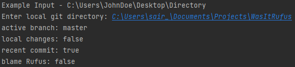
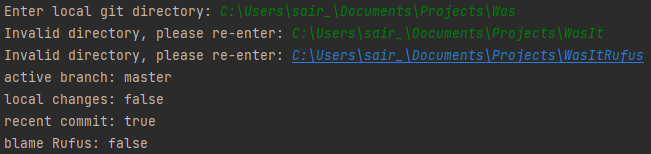

# Pronto.ai Take Home Assessment
* This program prints specific facts about a local git repository

## Set-Up/Run
* Clone the repository with 
```
git clone https://github.com/sairabbas/WasItRufus
```
* Run the application with ```src/Main.java``` as the configuration (Tip: you can right-click the file and select RUN)
* No additional packages or dependencies required, only uses core Java modules

## Screenshots
Entered a valid local git directory



Entered an invalid local git directory



## Input
* git_dir: directory in which to assess git status

## Output
* Active branch (string)
* Whether repository files have been modified (boolean)
* Whether the current head commit was authored in the last week (boolean)
* Whether the current head commit was authored by Rufus (boolean)
